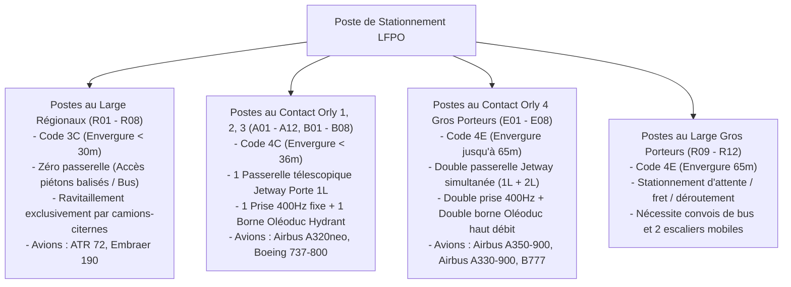

# Spécification et Plan d'Implémentation Avancé : Simulation Opérationnelle Aéroportuaire (LFPO)

Ce document constitue la spécification technique et opérationnelle exhaustive pour le développement en C (C99/C11 avec avertissements stricts `-Wall -Wextra -Wpedantic`) de la simulation aéroportuaire multi-agents de Paris-Orly (LFPO). Il intègre les manuels de caractéristiques aéroportuaires constructeurs (**Airbus Aircraft Characteristics - Airport and Maintenance Planning - AC** pour court, moyen et long-courrier), la réglementation aéronautique internationale (**OACI Annexe 14, EASA, DGAC**) et la gestion fine des postes de stationnement et des temps de rotation d'escale (**Turnaround Time - TaT**).

---

## 1. Vision Opérationnelle : Réalisme Procédural et Dialogues Multi-Agents

Dans cette simulation, **aucun événement n'est passif ou purement temporel**. L'ensemble de la plateforme fonctionne sur une chaîne de **demandes, vérifications, autorisations et exécutions physiques** impliquant :
1. **L'Équipage (Cockpit)** : Écoute ATIS, demande clairance de mise en route (Delivery), guidage sol (Ground), autorisations piste (Tower), dialogue interphone passerelle/sol (`Cockpit to Ground`), signature de la fiche de pesée et centrage (*Loadsheet*).
2. **Le Contrôle Aérien (ATC - Tour & Sol LFPO)** :
   - *Pré-vol (Delivery 121.700 MHz)* : Attribution SID, transpondeur (Squawk), niveau initial.
   - *Sol (Ground 121.800 MHz)* : Autorisation repoussage (*pushback*), clairance de roulage pas-à-pas avec points d'arrêt intermédiaires (*holding points*), traversée de piste, gestion du véhicule *Follow-Me*.
   - *Tour (Tower 118.700 MHz / 127.550 MHz)* : Espacement sillage OACI, alignement (*lineup*), clairance de décollage/atterrissage, gestion des procédures de basse visibilité (*LVP*), gestion des urgences (*Mayday*).
3. **L'Agent d'Escale & Exploitation Sol (Ground Dispatch & Ramp Ops)** :
   - Guidage au poste par miroir VDGS (*Visual Docking Guidance System - Safedock*) ou placeur (*Marshaller*).
   - Pose des cales de roues (*chocks*), goupille de sécurité de train (*gear pins*).
   - Raccordement électrique adapté (28V DC pour court-courrier turbopropulseur, 1x 115V/400Hz pour moyen-courrier, 2x 115V/400Hz pour long-courrier) et climatisation sol PCA (*Pre-Conditioned Air*).
   - Arrimage passerelle (*Jetway*) : simple passerelle 1L (moyen-courrier) ou double passerelle 1L + 2L (long-courrier), escaliers mobiles aux postes au large.
   - Dispatching des camions de restauration hôtelière (*Catering*) aux portes droites 1R / 2R.
   - Ravitaillement carburant sous voilure (*Under-wing fueling*) calibré selon le segment de vol.
   - Chargement/déchargement bagages et fret : vrac pour court-courrier, conteneurs ULD (AKH/LD3) et palettes pour moyen et long-courrier.
   - Services sanitaires (*Toilet Service*) et eau potable (*Potable Water Service*).
   - Opération de repoussage adaptée à la masse de l'appareil (tracteur léger, standard ou lourd haute puissance).
4. **L'Exploitation Terminal & Passagers** :
   - Dimensionnement des lignes de contrôle de sûreté (PIF) et des aubettes policières (PAF frontières).
   - Gestion des passagers à mobilité réduite (PRM) avec camion élévateur *Ambulift*.
   - Annonces d'embarquement par zones/groupes, réconciliation bagages/passagers (*BRS*), édition de l'état de charge (*Loadsheet*).
   - Arbitrage de fermeture de porte (*Gate Closure*) et débarquement de bagages pour passagers *No-Show*.
5. **Services de Piste, Sécurité & Environnement (Plateforme)** :
   - Véhicule de mesure d'adhérence des pistes (*Grip Tester / Mu-Meter*).
   - Véhicule d'effarouchement aviaire (pyrotechnie/acoustique contre les risques d'ingestion aviaire).
   - Véhicule de guidage *Follow-Me*.
   - Service de Sauvetage et de Lutte contre l'Incendie des Aéronefs (SSLIA / ARFF).
   - Aire de dégivrage (*De-icing Pad*) avec calcul de la durée d'efficacité du fluide (*Holdover Time - HOT*).

---

## 2. Matrice Opérationnelle des Segments Aériens & Caractéristiques Airbus / Constructeurs

La flotte est segmentée en 3 grandes familles opérationnelles, chacune ayant ses exigences de postes de stationnement, de servitudes sol et de temps de rotation (**Turnaround Time - TaT**) :

```
┌───────────────────────────────────────────────────────────────────────────────────────────────────────┐
│ COURT-COURRIER (ATR 72, E190)    MOYEN-COURRIER (A320neo, B737)      LONG-COURRIER (A350-900, A330)   │
│ - Postes au large (Remote)       - Postes contact Orly 1, 2, 3       - Postes gros porteurs Orly 4    │
│ - TaT : 20 - 25 min              - TaT : 35 - 45 min                 - TaT : 75 - 90 min              │
│ - Chargement Vrac (Bulk)         - Conteneurs ULD AKH/LD3            - Multi-ULD LD3 + Palettes       │
│ - Ravitaillement modéré camion   - Borne oléoduc Hydrant 1 500 L/min - Double Hydrant 6 000 L/min     │
│ - Escaliers mobiles / sol        - 1 Passerelle Jetway (Porte 1L)    - Double Passerelle (1L + 2L)    │
│ - 1 prise 28V DC / 400Hz légère  - 1 prise GPU 115V/400Hz 90kVA      - 2 prises GPU 400Hz 90kVA       │
│ - Pas de catering ou léger       - 1 camion catering (Porte 1R)      - 2 camions catering (1R + 2R)   │
└───────────────────────────────────────────────────────────────────────────────────────────────────────┘
```

### Spécifications Détaillées par Segment

| Paramètre Constructeur & Opérationnel | Court-Courrier (Short-Haul) | Moyen-Courrier (Medium-Haul) | Long-Courrier (Long-Haul) |
| :--- | :--- | :--- | :--- |
| **Exemples d'Aéronefs** | **ATR 72-600**, Embraer E190 | **Airbus A320neo**, B737-800 | **Airbus A350-900**, A330-900 |
| **Catégorie Sillage OACI** | Light (L) / Medium inférieur | Medium (M) | Heavy (H) |
| **Code de Référence Aérodrome** | 3C (Envergure < 36m) | 4C (Envergure < 36m) | 4E (Envergure 52m - 65m) |
| **Capacité Passagers Type** | 70 passagers | 180 passagers | 325 passagers |
| **Envergure / Longueur** | 27.05 m / 27.17 m | 35.80 m / 37.57 m | 64.75 m / 66.80 m |
| **Rayon de Virage Train ($R_{\min}$)** | 18.5 m | 21.0 m | 42.0 m |
| **Postes Assignables à Orly** | **Postes au large R01 à R08** (Remote) | **Orly 1, 2, 3** (Contact) ou R09-R16 | **Orly 4 Gros Porteurs** (Contact E) |
| **Passerelles Télescopiques (Jetways)** | 0 (Escalier intégré ou sol) | 1 passerelle (Porte 1L) | **2 passerelles simultanées** (1L + 2L) |
| **Alimentation Électrique Sol** | 1 prise 28V DC ou 400Hz légère | 1 prise 115V/400Hz 90kVA | **2 prises 115V/400Hz 90kVA** |
| **Climatisation Sol (PCA)** | Optionnelle (1 conduit $8''$) | 1 conduit $8''$ gros débit | **2 conduits $8''$ très gros débit** |
| **Carburant Requis & Débit** | 1 500 - 3 000 kg (camion citerne) | 6 000 - 14 000 kg (Hydrant 1 500 L/min) | 40 000 - 90 000 kg (**Double Hydrant 6 000 L/min**) |
| **Soutes à Bagages & Fret** | 100% Vrac manuel (Belt Loader) | Conteneurs ULD AKH/LD3-45 + Vrac | **Conteneurs LD3 multiples + Palettes cargo** |
| **Engins de Manutention Soute** | 1 Tapis bagages (Belt Loader) | 1 Chargeur conteneurs ULD + 1 Tapis | **2 Chargeurs ULD haute levée (Fwd/Aft)** |
| **Service Hôtelier (Catering)** | 0 à 1 petit van de réappro | 1 camion élévateur (Porte 1R) | **2 camions élévateurs (Portes 1R et 2R/4R)** |
| **Services Eaux / Sanitaires** | Non systématique | 1 vidange toilette + 1 plein eau | Vidange complète + grand plein eau potable |
| **Tracteur Pushback Requis** | Tracteur léger (< 15 t) | Tracteur standard (25 - 35 t) | **Tracteur lourd haute puissance (50 - 60 t)** |
| **Nettoyage Cabine Requis** | Rapide (1 équipe, 8 min) | Standard (1 équipe, 15 min) | Approfondi bi-couloir (2 équipes, 30 min) |
| **Temps de Rotation Cible (TaT)** | **20 à 25 minutes** (*Quick turn*) | **35 à 45 minutes** (*Standard turn*) | **75 à 90 minutes** (*Long-haul turn*) |

---

## 3. Typologie et Affectation Géométrique des Postes à Orly (LFPO)

L'affectation d'un poste de stationnement est strictement conditionnée par les contraintes physiques de l'appareil (Code OACI, envergure, double passerelle, alimentation oléoduc) :



> [!CAUTION]
> **Interdiction d'Accostage Incompatible (Règle d'Incompatibilité Géométrique)**
> - Si l'opérateur tente d'assigner un A350 (Heavy, Code 4E) sur un poste A04 d'Orly 1 (Code 4C), le système refuse l'ordre : risque d'empiètement d'aile (*wingtip collision*) sur les postes adjacents A03/A05, impossibilité d'arrimer la double passerelle et absence de débit oléoduc adéquat.
> - Si un aéronef moyen-courrier est envoyé sur un poste au large sans oléoduc, l'opérateur doit obligatoirement dépêcher une citerne mobile de carburant et un convoi de bus passagers, augmentant le TaT et les coûts d'exploitation.

---

## 4. Déroulement Détaillé du Turnaround (TaT) par Segment

### A. Court-Courrier (ATR 72-600) — TaT : 25 minutes
```
Minute 00  : Arrêt sur bloc R02, calage roues, coupure moteurs, batterie/GPU 28V DC.
Minute 02  : Déploiement escalier intégré arrière, début débarquement des 68 passagers à pied.
Minute 04  : Accostage convoi bagages, déchargement manuel en vrac de la soute arrière.
Minute 08  : Fin débarquement PAX. Ravitaillement par camion-citerne (1 800 kg de kérosène).
Minute 12  : Nettoyage express cabine (ramassage déchets rangées).
Minute 15  : Début embarquement des 70 nouveaux passagers. Chargement des nouveaux bagages.
Minute 22  : Fermeture porte avion, signature fiche de pesée Loadsheet par le commandant.
Minute 24  : Retrait cales, repoussage ou autonome (si poste autonome sans tracteur).
Minute 25  : Roulage vers la piste de décollage.
```

### B. Moyen-Courrier (Airbus A320neo) — TaT : 40 minutes
```
Minute 00  : Alignement VDGS Safedock, arrêt bloc A04, calage roues, coupure moteurs.
Minute 02  : Connexion GPU 400Hz fixe + PCA. Extinction APU. Arrimage passerelle 1L.
Minute 04  : Début débarquement des 164 passagers.
Minute 05  : Accostage chargeur ULD porte cargo avant + tapis porte cargo arrière.
Minute 07  : Accostage camion hôtelier Catering porte 1R. Connexion serveur oléoduc sous aile droite.
Minute 12  : Début ravitaillement kérosène (7 500 kg à 1 500 L/min = ~6 minutes).
Minute 18  : Fin débarquement passagers. Équipe de nettoyage en cabine.
Minute 22  : Fin ravitaillement fuel, bon de livraison Fuel Slip signé. Fin catering porte 1R.
Minute 24  : Début embarquement nouveaux passagers par zones. Chargement nouveaux conteneurs ULD.
Minute 34  : Fin embarquement, fermeture porte cargo, réconciliation bagages BRS conforme.
Minute 36  : Retrait passerelle 1L. Remise et signature électronique Loadsheet (TOW/Centrage %MAC).
Minute 37  : Insertion goupille bypass direction, connexion tracteur pushback 30t.
Minute 38  : Autorisation repoussage ATC. Retrait des cales.
Minute 40  : Pushback sur voie W, démarrage des moteurs 2 puis 1.
```

### C. Long-Courrier (Airbus A350-900) — TaT : 80 minutes
```
Minute 00  : Guidage VDGS Safedock, arrêt bloc E03 Orly 4, calage roues principales et avant.
Minute 03  : Connexion de 2 prises GPU 115V/400Hz + 2 conduits PCA gros débit. Extinction APU.
Minute 05  : Arrimage simultané de 2 passerelles télescopiques : Porte 1L (Affaires) et Porte 2L (Éco).
Minute 08  : Début débarquement des 318 passagers.
Minute 10  : Accostage de 2 camions Catering : Porte 1R (galleys avant) et Porte 2R (galleys arrière).
Minute 12  : Accostage de 2 chargeurs ULD haute levée (soutes avant et arrière).
Minute 15  : Accostage camion vidange toilettes arrière + camion plein eau potable.
Minute 20  : Raccordement des deux tuyaux de ravitaillement sous voilure (Double Hydrant 6 000 L/min).
Minute 25  : Injection massive de 55 000 kg de kérosène (durée ~15 minutes).
Minute 32  : Fin débarquement passagers. Entrée des 2 équipes de nettoyage cabine bi-couloir.
Minute 42  : Fin du pompage carburant. Bon de livraison carburant contresigné.
Minute 45  : Fin nettoyage cabine, armement des galleys terminé, départ des camions Catering.
Minute 50  : Début embarquement des 325 nouveaux passagers via les 2 passerelles 1L et 2L.
Minute 52  : Chargement des conteneurs ULD de fret et bagages passagers.
Minute 68  : Embarquement terminé, contrôle d'embarquement BRS 100% rapproché.
Minute 72  : Rétraction des passerelles 1L et 2L. Contrôle de centrage et signature Loadsheet.
Minute 74  : Accouplement du tracteur pushback lourd haute puissance (55 tonnes).
Minute 76  : Goupille bypass insérée. Autorisation ATC repoussage et démarrage réacteurs.
Minute 80  : Pushback sur l'axe de voie, démarrage réacteurs Trent XWB, prêt au roulage piste 24.
```

---

## 5. Structures de Données Enrichies (`common/types.h`)

```c
#ifndef TYPES_H
#define TYPES_H

#include <stdint.h>
#include <stdbool.h>

#define MAX_FLIGHTS             128
#define MAX_GATES               64
#define MAX_VEHICLES            128
#define MAX_TAXIWAY_NODES       512
#define MAX_TAXIWAY_EDGES       1024
#define MAX_SERVICE_ROAD_NODES  256
#define MAX_SERVICE_ROAD_EDGES  512
#define MAX_BAGS_IN_TRANSIT     4096
#define MAX_AIRLINE_CONTRACTS   16
#define MAX_RADIO_LOG_ENTRIES   64

// Segments opérationnels d'avions
typedef enum {
    HAUL_SHORT,   // Court-courrier (ATR 72, E190)
    HAUL_MEDIUM,  // Moyen-courrier (A320neo, B737)
    HAUL_LONG     // Long-courrier (A350-900, A330-900)
} HaulType;

// Catégories OACI & Codes Aérodrome
typedef enum {
    WAKE_LIGHT,   // ATR 72 (Cat 3C)
    WAKE_MEDIUM,  // A320neo (Cat 4C)
    WAKE_HEAVY    // A350-900, A330-900 (Cat 4E)
} WakeCategory;

typedef enum {
    AIRBUS_A320NEO,
    AIRBUS_A330_900,
    AIRBUS_A350_900,
    ATR_72_600
} AircraftModel;

// Types de postes de stationnement
typedef enum {
    STAND_REGIONAL_REMOTE,  // Code 3C, au large, pas de passerelle, camion fuel
    STAND_CONTACT_MEDIUM,   // Code 4C, Orly 1/2/3, 1 passerelle 1L, hydrant simple
    STAND_CONTACT_HEAVY,    // Code 4E, Orly 4, double passerelle 1L+2L, double hydrant
    STAND_REMOTE_HEAVY      // Code 4E, au large, gros porteurs sans passerelle
} StandType;

// Automate fin d'un aéronef
typedef enum {
    FLIGHT_INBOUND_APPROACH,    // En descente / approche ILS
    FLIGHT_HOLDING_STACK,       // En circuit d'attente racetrack
    FLIGHT_FINAL_APPROACH,      // Alignement axe ILS
    FLIGHT_TOUCHDOWN_ROLLOUT,   // Roulage sur piste, décélération
    FLIGHT_RUNWAY_VACATING,     // Dégagement piste vers point d'attente
    FLIGHT_TAXI_IN,             // Roulage vers la porte assignée
    FLIGHT_VDGS_DOCKING,        // Accostage guidé par miroir Safedock
    FLIGHT_AT_GATE_TURNAROUND,  // En traitement escale complet
    FLIGHT_PUSHBACK_STARTUP,    // Repoussage et démarrage réacteurs
    FLIGHT_TAXI_OUT,            // Roulage vers point d'arrêt piste
    FLIGHT_LINEUP_WAIT,         // Alignement sur la piste
    FLIGHT_TAKEOFF_ROLL,        // Course de décollage
    FLIGHT_AIRBORNE_DEPARTED,   // En montée initiale
    FLIGHT_EMERGENCY_DIVERT     // Déroutement / Mayday
} FlightState;

// Points de servitude physique Airbus selon le segment
typedef struct {
    bool chocks_in_place;
    uint8_t gpu_plugs_connected;    // 0, 1 (28V/400Hz) ou 2 (400Hz Heavy)
    uint8_t pca_hoses_connected;    // 0, 1 ou 2 conduits
    bool asu_connected;             // Groupe démarrage pneumatique
    bool jetway_1l_docked;          // Passerelle passagers 1L
    bool jetway_2l_docked;          // Passerelle passagers 2L (Heavy uniquement)
    bool catering_1r_docked;        // Camion hôtelier avant droit
    bool catering_2r_docked;        // Camion hôtelier arrière droit (Long-courrier)
    uint8_t fuel_hoses_connected;   // 0, 1 sous aile D, ou 2 (voilures Heavy)
    bool cargo_loader_fwd_docked;   // Chargeur conteneurs ULD avant
    bool cargo_loader_aft_docked;   // Chargeur conteneurs ULD arrière
    bool belt_loader_bulk_docked;   // Tapis bagages vrac
    bool toilet_service_connected;  // Vidange sanitaires
    bool potable_water_connected;   // Remplissage eau potable
    bool steering_bypass_pin;       // Goupille bypass direction insérée
    bool pushback_tug_connected;    // Tracteur repoussage accouplé
    
    float fuel_flow_rate_lpm;       // Débit réel l/min
    float fuel_delivered_kg;        // Carburant injecté
    float fuel_target_kg;           // Consigne carburant commandée
    
    uint16_t deboarded_pax;
    uint16_t boarded_pax;
    uint16_t unloaded_bags;
    uint16_t loaded_bags;
    
    float target_tat_minutes;       // TaT nominal (25, 40 ou 80 min)
    float elapsed_tat_seconds;      // Temps écoulé en porte
    
    bool loadsheet_signed;          // Fiche de pesée signée par le commandant
    bool cabin_ready_signal;        // Signal cabine prête
} GroundServicingState;

// Structure du vol
typedef struct {
    uint32_t id;
    char callsign[8];               // "AFR422"
    char departure_icao[5];         // "LFPO"
    char destination_icao[5];       // "LFMN" / "JFK"
    HaulType haul;                  // HAUL_SHORT, HAUL_MEDIUM, HAUL_LONG
    AircraftModel model;
    WakeCategory wake_cat;
    FlightState state;
    
    // Position 3D & dynamique
    float x, y;                     // Mètres locaux (origine ARP)
    float altitude_ft;
    float heading_deg;
    float ground_speed_kts;
    float vertical_speed_fpm;
    
    // Navigation assignée
    uint8_t assigned_runway;        // 0: 06/24, 1: 07/25, 2: 02/20
    uint8_t assigned_gate;          // ID de porte
    uint32_t current_taxi_edge;
    uint32_t cleared_holding_point; // Point d'arrêt jusqu'où le roulage est autorisé
    uint16_t transponder_code;      // Squawk (ex: 4215)
    char assigned_sid[8];           // "AGOP1E"
    
    // Devis de masse et centrage (Airbus Loadsheet)
    float dry_operating_weight_kg;  // DOW
    float zero_fuel_weight_kg;      // ZFW
    float take_off_weight_kg;       // TOW (Max Structural TOW)
    float center_of_gravity_mac;    // % MAC (ex: 28.5%)
    
    // Servitude et opérations sol
    GroundServicingState ground_ops;
    
    // Passagers et fret
    uint16_t pax_booked;
    uint16_t pax_onboard;
    uint16_t prm_count;             // Passagers nécessitant assistance
    uint16_t bags_checked;
    uint16_t bags_loaded;
    
    // Urgences & aléas
    bool is_emergency;
    uint8_t emergency_cause;        // 0: None, 1: Engine Fire, 2: Bird Strike, 3: Low Fuel, 4: Gear Fail
    uint32_t delay_seconds;
} Flight;

// Poste de stationnement calibré
typedef struct {
    uint8_t id;
    char name[8];                   // "A01", "B04", "E03", "R02"...
    StandType stand_type;           // STAND_REGIONAL_REMOTE, STAND_CONTACT_MEDIUM, etc.
    float max_wingspan_meters;      // 36.0 m (Medium) ou 65.0 m (Heavy)
    float x, y;
    float heading_deg;
    bool has_hydrant_fuel;          // Bornes oléoducs enterrées
    bool has_dual_hydrant;          // Bornes doubles pour gros porteurs
    uint8_t jetway_count;           // 0 (au large), 1 (Medium), 2 (Heavy)
    uint8_t fixed_400hz_plugs;      // 0, 1 ou 2 prises
    bool is_occupied;
    uint32_t current_flight_id;
} Gate;
```

---

## 6. Protocole Réseau Étendu (`common/protocol.h`)

Le protocole standardise les ordres pour commander l'ensemble des servitudes spécifiques :

```c
typedef enum {
    MSG_NONE = 0,
    
    // Connexion et Attribution des Postes
    CMD_CONNECT,
    CMD_SWITCH_ROLE,
    CMD_GATE_ASSIGN,                // Affectation d'un poste avec vérification de compatibilité de classe
    
    // Commandes Tour & Sol ATC
    CMD_ATC_CLEARANCE_DELIVERY,     // Autorisation départ (SID, transpondeur, niveau)
    CMD_ATC_PUSHBACK_APPROVE,       // Autorisation repoussage & démarrage (face Nord/Sud)
    CMD_ATC_TAXI_CLEARANCE,         // Clairance roulage jalonnée par point d'arrêt (holding point)
    CMD_ATC_LINEUP_RUNWAY,          // Autorisation alignement piste
    CMD_ATC_TAKEOFF_CLEARANCE,      // Autorisation de décollage
    CMD_ATC_LANDING_CLEARANCE,      // Autorisation d'atterrissage
    CMD_ATC_GO_AROUND,              // Ordre de remise de gaz immédiate
    CMD_ATC_DISPATCH_FOLLOW_ME,     // Envoi d'un véhicule Follow-Me
    
    // Commandes Chef Avion Sol & Ramp Ops (Servitude Airbus par segment)
    CMD_RAMP_ATTACH_CHOCKS,         // Pose des cales de roues
    CMD_RAMP_CONNECT_POWER,         // Raccordement GPU (1 ou 2 prises 400Hz/28V) et PCA
    CMD_RAMP_DOCK_JETWAYS,          // Arrimage passerelles (1L seule ou 1L + 2L simultanées)
    CMD_RAMP_ORDER_CATERING,        // Dépêcher camions hôteliers (1R seul ou 1R + 2R)
    CMD_RAMP_ORDER_FUEL,            // Ravitaillement (quantité kg, raccord simple ou double voilure)
    CMD_RAMP_DISPATCH_BAGGAGE,      // Envoi convoi bagages & chargeurs ULD avant/arrière
    CMD_RAMP_ORDER_TOILET_WATER,    // Vidange sanitaires et plein eau potable
    CMD_RAMP_ORDER_DEICING,         // Dépêcher camion dégivreur (Type I/IV)
    CMD_RAMP_PREPARE_PUSHBACK,      // Goupille bypass & accouplement tracteur (calibre Light/Med/Heavy)
    CMD_RAMP_INTERCOM_SPEAK,        // Message interphone au cockpit
    
    // Commandes Terminal & Passagers
    CMD_TERMINAL_CONFIG_LANES,      // Ajustement des lignes PIF et aubettes PAF
    CMD_TERMINAL_CALL_BOARDING,     // Début de l'embarquement par zones (Zone 1 Affaires, Zones 2-4 Éco)
    CMD_TERMINAL_DISPATCH_PRM,      // Envoi camion Ambulift pour passagers handicapés
    CMD_TERMINAL_SIGN_LOADSHEET,    // Validation de la fiche de charge et centrage (ZFW/TOW/%MAC)
    CMD_TERMINAL_GATE_CLOSE,        // Arbitrage fermeture porte (débarquer bagages no-show)
    
    // Commandes Plateforme, Sécurité & Économie
    CMD_PLATFORM_RUNWAY_INSPECT,    // Lancement véhicule frottement / inspection FOD
    CMD_PLATFORM_BIRD_DISPERSAL,    // Lancement patrouille effarouchement aviaire
    CMD_PLATFORM_SSLIA_STANDBY,     // Mise en alerte véhicule pompier Panther
    CMD_ECONOMY_ORDER_PIPELINE,     // Commande livraison kérosène par pipeline
    CMD_ECONOMY_SIGN_CONTRACT,      // Signature de contrat compagnie aérienne (SLA ponctualité)
    CMD_DEBUG_INJECT,               // Console d'injection développeur
    
    // Notifications Serveur -> Clients
    NET_ROLE_ASSIGNED,
    NET_SNAPSHOT_WORLD,             // Instantané complet du monde (20 Hz)
    NET_RADIO_MESSAGE_BROADCAST,    // Diffusion ligne journal radio
    NET_ALERT_BROADCAST             // Alarme visuelle / sonore (incursion, incompatible stand, mayday)
} NetMessageType;
```

---

## 7. Plan de Tests et de Validation

### Tests Automatisés (`tests/test_main.c`)
1. **Validation des Contraintes d'Affectation des Postes** :
   - Tenter d'assigner un A350-900 (Heavy, Code 4E) sur un poste régional R02 ou moyen-courrier A04 $\to$ vérifier le rejet de la commande avec alerte d'incompatibilité géométrique d'envergure.
   - Assigner l'A350 sur le poste E03 d'Orly 4 $\to$ valider l'acceptation et l'activation des deux passerelles 1L + 2L.
2. **Validation des Séquences et Durées de TaT** :
   - Tester la rotation complète d'un ATR 72 sur stand R02 $\to$ valider le TaT cible de 25 minutes.
   - Tester la rotation d'un A320neo sur stand A04 $\to$ valider le TaT cible de 40 minutes (GPU simple, Hydrant simple, 1 Jetway).
   - Tester la rotation d'un A350-900 sur stand E03 $\to$ valider le TaT cible de 80 minutes (Double GPU, Double Hydrant 6000 L/min, Double Catering 1R/2R, Double Jetway 1L/2L).
3. **Validation de la Puissance du Tracteur de Repoussage** :
   - Vérifier qu'un tracteur pushback `GSE_PUSHBACK_TUG_LIGHT` est incapable de déplacer un A350-900 et exige un tracteur lourd `GSE_PUSHBACK_TUG_HEAVY`.
4. **Validation de la Séparation de Sillage OACI** :
   - Vérifier les espacements réglementaires : 6 NM derrière un A350 pour un ATR 72, 5 NM pour un A320, 4 NM pour un autre A350.
5. **Persistance Binaire Bit-à-Bit** :
   - Sauvegarder et recharger l'état complet du monde avec vols de différents segments, portes calibrées et engins GSE via `SaveGameState()` et `LoadGameState()`.

### Validation Interactive
- Lancement du serveur `./airport_server --port 8080`.
- Lancement du client radar `./airport_client --connect 127.0.0.1:8080`.
- Réalisation d'une session complète intégrant simultanément un court-courrier au large, un moyen-courrier à Orly 1 et un long-courrier à Orly 4, avec contrôle des flux passagers, du dispatching matériel et des clairances ATC.
